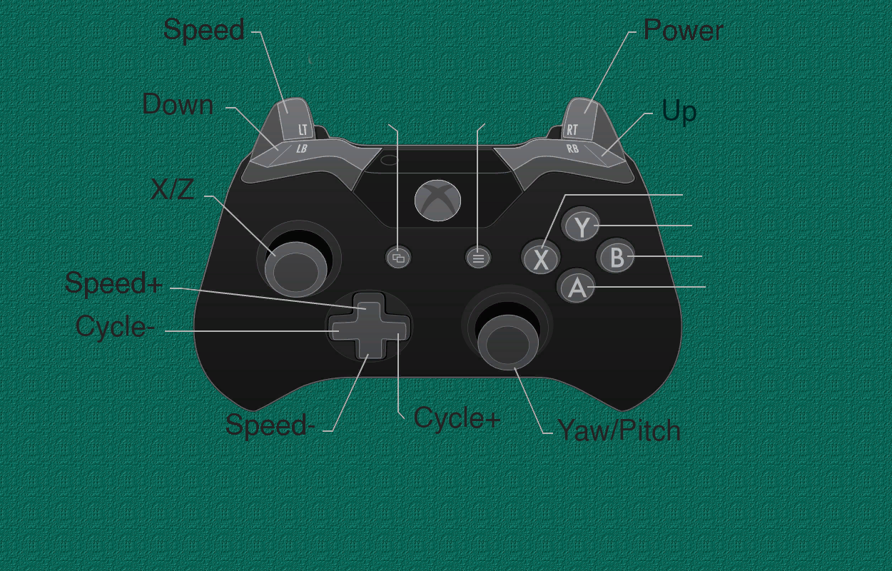

# VRDentist

## Description
VRDentist is a virtual reality application that simulates a dental clinic.  
The application is designed to help users practice their dental skills in a realistic and immersive environment.  
The application is designed to be used with a VR headset and a controller.  
The user can interact with the environment by using the controller to pick up and use dental tools.  
The application is designed to be used in a clinical setting, where the user can practice their dental skills in a safe and controlled environment.  

## Controls

#### Eagle Camera
- **Space**: Lock cursor/Activate camera
- **WSAD**: Move
- **EQ**: Move up and down
- **Mouse**: Look around

#### Tools
- **LeftTrigger**: Inversely proportional to the movement speed of the tool
- **RightTrigger**: proportional to the drilling power of the tool
- **LeftBumper**: Move tool on the negative Y axis
- **RightBumper**: Move tool on the positive Y axis
- **LeftStick**: Move the tool on the XZ plane
- **RightStick**: Rotate the tool around the YZ axis
- **LeftDPad**: Cycle tool index backwards
- **RightDPad**: Cycle tool index forwards
- **UpDPad**: Increment Speed
- **DownDPad**: Decrement Speed

