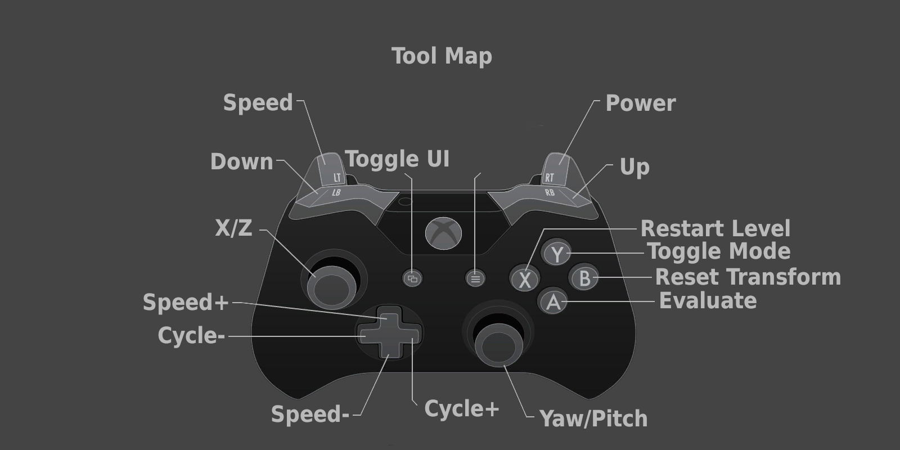

# VRDentist

## Controls

### Eagle Camera
##### Keyboard & Mouse
- **Space**: Lock cursor/Activate camera
- **WSAD**: Move
- **EQ**: Move up and down
- **Mouse**: Look around

##### Controller
- **LeftTrigger**: Inversely proportional to the movement speed of the camera
- **RightTrigger**: Inversely proportional to the look sensitivity of the camera
- **LeftBumper**: Move camera on the negative Y axis
- **RightBumper**: Move camera on the positive Y axis
- **LeftStick**: Move the camera on the XZ plane
- **RightStick**: Rotate the camera on the XY plane
- **LeftDPad**: Decrement Sensitivity
- **RightDPad**: Increment Sensitivity
- **UpDPad**: Increment Speed
- **DownDPad**: Decrement Speed
- **StartButton**: Lock cursor/Activate camera
- **WestButton**: Reset camera transform to default
- **EastButton**: Manually save voxel cache
- **NorthButton**: Toggle input modes

### Tools
- **LeftTrigger**: Inversely proportional to the movement speed of the tool
- **RightTrigger**: proportional to the drilling power of the tool
- **LeftBumper**: Move tool on the negative Y axis
- **RightBumper**: Move tool on the positive Y axis
- **LeftStick**: Move the tool on the XZ plane
- **RightStick**: Rotate the tool around the YZ axis
- **LeftDPad**: Cycle tool index backwards
- **RightDPad**: Cycle tool index forwards
- **UpDPad**: Increment Speed
- **DownDPad**: Decrement Speed
- **WestButton**: Reset tool transform to default
- **EastButton**: Manually save voxel cache
- **NorthButton**: Toggle input modes

